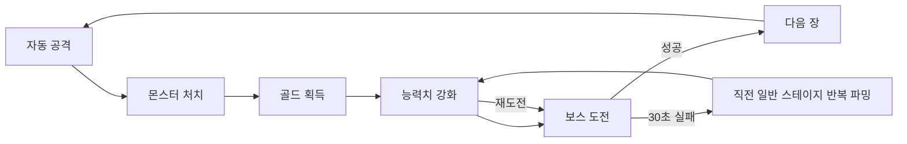

# 핵심 게임 루프

## 루프 요약

복서는 자동 공격으로 몬스터를 처치하고, 플레이어는 골드를 능력치에 투자해 보스 제한 시간을 돌파한다.

## 단계별 규칙

### 1. 자동 공격

- 공격 간격은 `1 / attackSpeed`초다.
- 전투 시작 직후 공격하지 않고 첫 공격까지 한 공격 간격을 기다린다.
- 공격 시 주입된 난수로 치명타를 판정하고 몬스터 HP에서 피해를 뺀다.
- 하나의 스케줄러만 사용하며 실제 시각을 기준으로 다음 공격과 보스 남은 시간을 계산한다.

### 2. 처치와 보상

- 몬스터 HP가 0 이하가 되면 한 번만 처치 처리한다.
- 초과 피해는 다음 몬스터로 전달하지 않는다.
- 처치 골드는 골드 보너스를 적용해 지급하고 총 처치 수를 1 올린다.
- 일반 몬스터는 처치 즉시 다음 스테이지로 이동한다.

### 3. 성장

- 플레이어는 골드로 5개 강화 레벨 중 하나를 올린다.
- 실제 능력치는 저장한 강화 레벨에서 순수 함수로 계산한다.
- 상한에 도달한 공격속도·치명타율·치명타 피해·골드 보너스는 더 강화하지 않는다.

### 4. 보스

- 각 장의 5스테이지는 30초 제한 보스다.
- 제한 시각과 정확히 같은 시각의 예약 공격은 먼저 처리하고, 보스가 살아 있으면 실패 처리한다.
- 성공하면 다음 장 1스테이지, 실패하면 같은 장 4스테이지로 이동한다.
- 반복 파밍 중 재도전 버튼을 누르면 현재 일반 몬스터 HP를 버리고 보스를 최대 HP와 30초로 새로 시작한다.

### 5. 무한 진행

- 1장 숲 입구, 2장 늑대 숲, 3장 바위 협곡 테마를 사용한다.
- 4장부터 같은 순서로 테마를 재사용한다.
- 장 번호에 따라 HP와 골드만 지수적으로 증가하므로 마지막 장은 없다.

### 6. 오프라인 파밍

- 백그라운드 진입 시 전투를 멈추고 즉시 저장한다.
- 복귀 시 최대 8시간 동안 현재 일반 스테이지만 반복 처치한 것으로 정산하며 스테이지는 전진하지 않는다.
- 보스에서 이탈했다면 같은 장 4스테이지로 돌아간 뒤 그 일반 몬스터를 기준으로 정산한다.

## 피드백 기준

- 몬스터 HP 바, 최근 피해와 치명타 여부, 처치 골드를 즉시 표시한다.
- 현재 `장-스테이지`, 테마, 보스 여부와 남은 시간을 상시 표시한다.
- 강화 버튼에는 현재 레벨, 다음 효과와 비용 부족·상한 상태를 표시한다.
- 복귀 시 경과 시간, 처치 수와 획득 골드를 한 번만 요약한다.

## 신규 전투 모델 연동

가정: `수정내용2`는 위 루프에 복서 HP·몬스터 공격·회피/가드/카운터를 더한다. 복서 HP가 0이면 현재 스테이지에 머물고, 회피·가드 강화가 새로운 생존 수단이 된다.

- 몬스터 공격과 회피/가드/카운터 판정 → [몬스터 공격](../combat/monster-attacks.md)
- 복서 HP와 실패 처리 → [체력과 실패](../combat/hp-and-defeat.md)
- 보스 그로기와 강공격 예고 → [보스전](../combat/boss.md)

## 관련 문서

- [게임 시스템](../systems/game-systems.md)
- [능력치와 수식](../systems/stats-and-formulas.md)
- [유저 플로우](../progress/user-flow.md)
