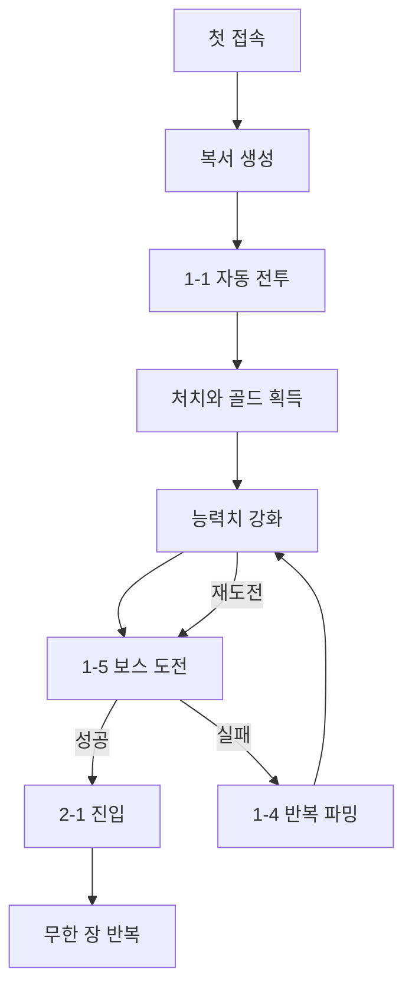

# 첫 플레이 유저 플로우

## 목표

첫 세션에서 자동 공격, 처치 골드, 능력치 강화와 보스 실패 후 재도전의 관계를 자연스럽게 체험시킨다.

## 흐름

## 1. 첫 접속과 복서 생성

- v2 저장이 없으면 복서 이름 입력 화면을 연다.
- 이름이 비었거나 제한 길이를 넘으면 즉시 오류를 표시한다.
- 지원하지 않는 v1 저장이 있으면 삭제하지 않고 호환 불가와 새 게임 생성 선택지를 안내한다.

## 2. 첫 자동 전투

- 생성 직후 1-1 숲 입구의 일반 몬스터를 표시한다.
- 초기 공격속도는 초당 1회이며 첫 공격은 1초 뒤 발생한다.
- 몬스터 HP 바, 현재 스테이지와 최근 피해·치명타 여부를 보여준다.

## 3. 첫 처치와 강화

- 몬스터가 죽으면 골드와 총 처치 수가 증가하고 1-2로 자동 이동한다.
- 강화 패널에서 현재 값, 레벨, 다음 값과 비용을 비교할 수 있다.
- 비용이 부족하거나 상한에 도달한 버튼은 이유가 드러나도록 비활성화한다.

## 4. 첫 보스

- 1-4 처치 후 1-5 보스를 최대 HP와 30초 타이머로 시작한다.
- 보스를 처치하면 2-1 늑대 숲으로 자동 이동한다.
- 실패하면 안내 후 1-4 반복 파밍으로 돌아간다.

## 5. 보스 재도전

- 반복 파밍 동안 골드를 모으고 능력치를 강화한다.
- 재도전 버튼을 누르면 현재 일반 몬스터 진행을 버리고 1-5 보스를 새로 시작한다.
- 연속 입력으로 보스 전투나 보상이 중복 생성되지 않아야 한다.

## 6. 재접속

- 백그라운드 진입 시 전투를 멈추고 즉시 저장한다.
- 복귀 시 최대 8시간의 일반 스테이지 반복 파밍 보상을 한 번 정산한다.
- 경과 시간, 처치 수와 골드를 요약하고 같은 전투 화면으로 복귀한다.

## 예외 흐름

- 저장 실패: 현재 세션은 유지하되 새로고침 시 유실 가능성을 안내한다.
- 손상된 v2 데이터: 오류 없이 새 게임 생성 화면과 안내를 표시한다.
- 보스 중 이탈: 같은 장 4스테이지로 복귀해 오프라인 보상을 계산한다.
- 시스템 시각 역행: 오프라인 보상은 0으로 처리한다.

## 관련 문서

- [프로젝트 개요](../overview/concept.md)
- [핵심 루프](../overview/core-loop.md)
- [MVP 범위](../overview/mvp-scope.md)
