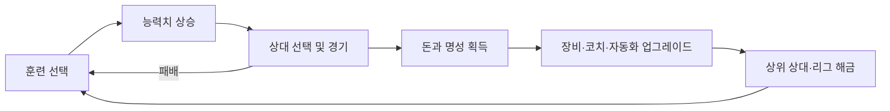

# 핵심 게임 루프

## 루프 요약

복서는 훈련으로 강해지고, 경기로 자원을 얻으며, 업그레이드로 다음 성장 속도와 승률을 높인다.

## 단계별 규칙

### 1. 훈련

- 플레이어가 훈련 종류를 선택하고 시간 또는 행동력을 소비한다.
- 훈련별 주 능력치와 보조 능력치가 다르다.
- 장비, 코치, 자동화 배율을 적용해 최종 증가량을 계산한다.
- 가정: MVP의 수동 훈련은 즉시 완료되며 연속 실행할 수 있다.

### 2. 성장

- 체력, 공격력, 방어력, 스피드가 오르면 전투력이 갱신된다.
- 특정 누적 성장 또는 명성 조건에서 콘텐츠가 해금된다.
- 성장 속도는 초반에 빠르고 후반에 완만해지도록 비용과 요구량을 높인다.

### 3. 경기

- 상대 정보와 예상 승률을 확인한 후 도전한다.
- 양측 전투력 차이를 기반으로 확률 판정을 수행한다.
- 승리와 패배 결과, 획득 자원, 다음 추천 행동을 표시한다.

### 4. 보상

- 승리 시 돈과 명성을 지급하고 최초 승리 보상을 추가할 수 있다.
- 패배 시 기본 보상은 없으며 `TODO: 위로 보상 지급 여부`를 확정한다.
- 명성은 상대 및 리그 해금, 돈은 장비 구매에 사용한다.

### 5. 업그레이드

- 장비는 능력치 또는 훈련 효율을 높인다.
- 코치는 특정 훈련이나 능력치 획득량에 배율을 제공한다.
- 자동 훈련은 접속 중 또는 오프라인 성장의 기반이 된다.

### 6. 더 강한 상대 도전

- 이전 상대 최초 승리와 명성 조건을 만족하면 다음 상대가 열린다.
- 상위 상대는 더 높은 보상과 새로운 성장 목표를 제공한다.
- 세계 챔피언 최초 승리를 MVP 이후 장기 목표로 둔다.

## 피드백 기준

- 모든 행동은 수치 변화, 애니메이션 또는 로그로 즉시 결과를 알려준다.
- 패배 화면은 승률과 부족한 핵심 능력치를 보여준다.
- 다음 해금까지 필요한 돈·명성·승리 조건을 상시 확인할 수 있어야 한다.

## 관련 문서

- [게임 시스템](./game-systems.md)
- [능력치와 수식](./stats-and-formulas.md)
- [유저 플로우](./user-flow.md)

