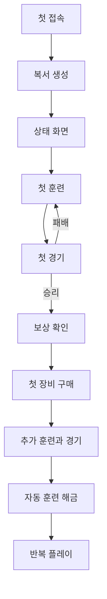

# 첫 플레이 유저 플로우

## 목표

첫 세션에서 훈련, 경기, 보상, 장비의 관계를 체험시키고 자동 훈련이라는 다음 목표를 제시한다.

## 흐름

## 1. 첫 접속

- 저장 데이터가 없으면 복서 생성 화면을 연다.
- 핵심 목표를 “훈련해서 첫 상대에게 승리하세요” 한 문장으로 안내한다.

## 2. 복서 생성

- 이름을 입력하고 기본 외형을 선택한다.
- `TODO: 외형 선택을 MVP에 포함할지 확정`
- 이름이 비었거나 제한 길이를 넘으면 즉시 오류를 표시한다.

## 3. 첫 훈련

- 상태 화면에서 공격력과 샌드백 훈련을 강조한다.
- 훈련 전후 능력치와 첫 상대 승률 변화를 함께 보여준다.
- 가정: 첫 훈련은 비용 없이 진행해 막힘을 방지한다.

## 4. 첫 경기

- 동네 양아치의 전투력, 예상 승률, 보상을 표시한다.
- 도전 버튼으로 단일 판정을 실행하고 결과를 즉시 연출한다.
- 패배하면 무료 추가 훈련으로 돌아갈 수 있게 한다.

## 5. 첫 보상

- 승리로 받은 돈과 명성, 해금된 항목을 순서대로 표시한다.
- 보상이 어떤 용도인지 한 줄 도움말로 설명한다.

## 6. 첫 장비 구매

- 구매 가능한 연습용 글러브를 추천하고 구매 전후 공격력을 비교한다.
- 구매 후 장착 효과와 다음 상대 승률 변화를 표시한다.

## 7. 자동 훈련 해금

- 명성 또는 특정 상대 승리 조건에 도달하면 기능을 소개한다.
- 훈련 종류를 선택하고 자동 누적이 시작되는 것을 확인시킨다.
- `TODO: 정확한 해금 조건 확정`

## 8. 반복 플레이 진입

- 다음 상대, 추천 전투력, 해금까지 남은 조건을 홈 화면에 제시한다.
- 재접속 시 오프라인 보상을 정산하고 동일한 루프로 복귀한다.

## 예외 흐름

- 저장 불러오기 실패: 안전한 백업 복구를 시도하고 실패 원인을 안내한다.
- 비용 부족: 필요한 자원과 획득 가능한 행동을 연결한다.
- 연속 패배: 부족한 능력치와 효율적인 훈련을 추천한다.

## 관련 문서

- [프로젝트 개요](./overview.md)
- [핵심 루프](./core-loop.md)
- [MVP 범위](./mvp-scope.md)

